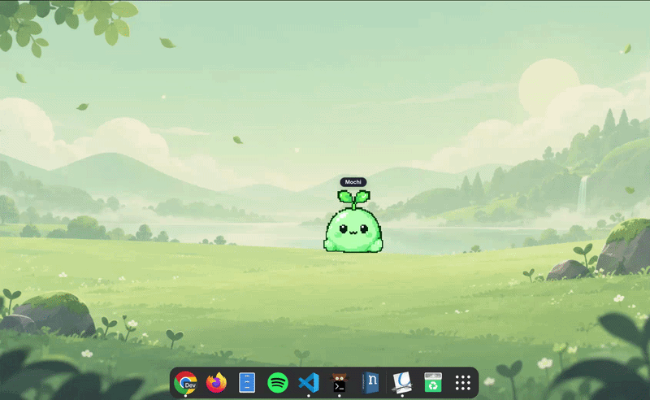
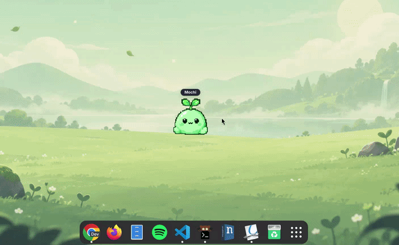
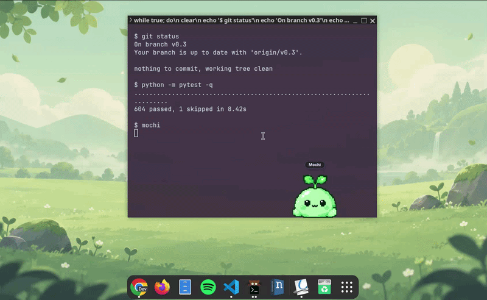

<div align="center">

# mochi for Mac 🌱

### A tiny desktop buddy that keeps you company while you code.


**You never code alone again.**

[Install](#installation) · [Controls](#controls) · [Features](#features) · [Building](#build-from-source-apple-silicon--intel) · [Credit](#credit--attribution) · [Releases](https://github.com/kwakuoseikwakye/mochi-desktop-mac/releases)

<br>


[](https://github.com/kwakuoseikwakye/mochi-desktop-mac/releases)

</div>

---

Mochi is a lightweight desktop companion for macOS. A small green character that idles, looks around, dozes off, and hangs out on your screen while you work.

This is an unofficial native macOS port of [miflow13/mochi-desktop](https://github.com/miflow13/mochi-desktop) (the original Linux/GNOME companion), built from scratch in Swift and AppKit with zero external dependencies.

---

## Features

- **Presence:** Mochi sits on your desktop, idles, blinks, looks around, sleeps, and wakes up.
- **Interactivity:** Click for bounce or squish reactions, double-click for a heart emote, feed him snacks, or drag him anywhere.
- **Sound Effects & Rain Ambience:** Native audio cues for interactions (chirp, eat, spawn, exit, menu open, level-up) and an ambient looping rain sound during focus sessions. Fully toggleable with volume presets (muted by default).
- **Bond Progression:** Form a deeper connection with Mochi over time across 5 progressive relationship phases (*New*, *Familiar*, *Comfortable*, *Close*, *Deep Bond*). Earn daily affection XP through typing awareness, feeding snacks, and completing 25-minute focus sessions. Celebrate each level-up with a floating celebratory banner!
- **Emote Catalogue:** Browse 20+ expressive animations in a dedicated floating panel. Search by keyword, filter by category (*Reactions*, *Work*, *Moods*, *Playful*), preview animations on hover, and trigger any emote instantly on your desktop.
- **Awareness:** Mochi notices when you switch between code editors, terminals, and browsers. After 5 minutes without keyboard, mouse, or scroll input, he dozes off and wakes when you return.
- **Focus Sessions:** Start a 25-minute focus session from the menu. Mochi stays calm and quiet beside you, with a heart reward when your session finishes.
- **Roaming:** Mochi occasionally takes a short walk along the bottom of your screen, pausing immediately if you type, click, drag, or start a focus session.
- **Menu Bar Companion:** A 🌱 menu-bar icon lets you view current Bond level & XP progress, open the Emote Catalogue, bring Mochi to your active screen, or quit anytime.

---

### Share a snack

<p align="center">
  
</p>

The right-click menu includes **Feed**. Mochi plays an authored eating animation and responds with a little heart.

### Work beside each other

<p align="center">
  
</p>

**Focus with Mochi** starts a 25-minute Pomodoro focus block. Mochi stays calm and quiet on your screen while you work, celebrating with a heart at the end.

### Terminal & Code Editor Awareness

<p align="center">
  
</p>

Mochi notices when you switch to your code editor or terminal, and dozes off after 5 minutes of inactivity, waking up when you return.

### Emote Catalogue & Extended Animations

Open **Emote Catalogue...** from Mochi's context menu or the menu bar (`🌱`) to access 20+ expressive animations imported from upstream Mochi:

- **Categories & Instant Search:** Filter by *All*, *Reactions*, *Work*, *Moods*, or *Playful*, or type in the search bar for live instant filtering (`table flip`, `coffee`, `typing`, `dance`, etc.).
- **Live Hover Previews:** Hover your cursor over any emote card to preview the animation running in real time at full frame rate.
- **Desktop Playback:** Click any card to trigger the emote directly on your desktop companion. Looping emotes return to idle after a few seconds, and any user interaction (click, drag, typing) interrupts the emote instantly.
### Bond Progression & Celebrations

Mochi remembers your daily time together and grows closer to you:
- **5 Relationship Phases:** Progress through *New* (Lvl 1–2), *Familiar* (Lvl 3–4), *Comfortable* (Lvl 5–7), *Close* (Lvl 8–10), and *Deep Bond* (Lvl 11+).
- **Affection XP:** Earn XP naturally as you work — +1 XP per second of active typing awareness, +25 XP per snack feed (up to 2 feeds per 10-minute window), and +150 XP for every completed 25-minute focus session.
- **Daily Affection Cap:** Capped at 600 XP per calendar day to encourage healthy, sustainable work habits.
- **Celebrations:** Leveling up triggers a celebratory chime sound effect and displays a floating pill banner (`🎉 Level N · [Phase]`) above Mochi.
- **Live Progress & Reset:** See your current level, phase, and XP directly in the context menu and menu bar, with an option to reset anytime.

---

## Controls

| Interaction | Action |
| :--- | :--- |
| **Left-click** | Bounce or squish reaction |
| **Double-click** | Heart emote ❤️ |
| **Drag & Drop** | Pick up and reposition Mochi anywhere |
| **Right-click / Control-click** | View Bond level & XP progress, Emote Catalogue..., Feed snack (+25 XP), heart, sleep/wake, change size (small / medium / large), sound effects toggle, volume presets, focus rain toggle, toggle Awareness & Roaming, Reset Bond... |
| **Click sleeping Mochi** | Wake him up |
| **🌱 Menu bar icon** | View Bond level & XP progress, Emote Catalogue..., Bring Mochi to current display, Reset Bond..., quit |

---

## Installation

### Download pre-built release (Apple Silicon)

1. Download `Mochi-0.1.0-macos-arm64.zip` from [Releases](https://github.com/kwakuoseikwakye/mochi-desktop-mac/releases).
2. Unzip and drag `Mochi.app` into `/Applications`.
3. Because release builds are self-signed and not notarized, macOS sets a quarantine flag on downloaded binaries. Run this once in Terminal to allow it:

```sh
xattr -dr com.apple.quarantine /Applications/Mochi.app
```

4. Open Mochi from Applications or Spotlight.

*Requires Apple Silicon (M1/M2/M3/M4) running macOS 13 (Ventura) or newer.*

---

### Build from source (Apple Silicon & Intel)

Building from source requires macOS 13+ and Xcode command line tools (`xcode-select --install`):

```sh
git clone https://github.com/kwakuoseikwakye/mochi-desktop-mac.git
cd mochi-desktop-mac

# Build release bundle
bash scripts/build.sh

# Run
open dist/Mochi.app
```

---

## Privacy & Permissions

Mochi is designed to be completely unobtrusive and private:

- **Zero permissions required:** Mochi does not ask for Accessibility, Screen Recording, or Input Monitoring permissions.
- **No keylogging:** Mochi only checks the time elapsed since your last input (`CGEventSource.secondsSinceLastEventType`) to know when you are actively typing or idle. It never reads or records your keystrokes.
- **No window snooping:** Mochi only inspects the active application's bundle identifier (to distinguish code editors and terminals from web browsers). It cannot see window contents or titles.
- **Zero network activity:** Mochi makes no network requests and has no analytics or telemetry.

---

## Testing & Verification

Run the automated test suite and smoke test:

```sh
# Run 68 unit tests (companion, awareness, focus, roaming, emotes, sound, bond progression)
swift test

# Run smoke test (verifies 308 animation frames, 7 audio assets, Bond progression, and celebration banner in an offscreen panel)
dist/Mochi.app/Contents/MacOS/MochiMac --smoke-test
```

---

## Credit & Attribution

Mochi for Mac is an unofficial Mac port of [Mochi](https://github.com/miflow13/mochi-desktop) created by **miflow13** and the Mochi contributors.

- The character design, sprites, and animations are from upstream commit `9cdd100`, used under the MIT License.
- The macOS implementation is a new native Swift/AppKit codebase.
- Upstream license and credits are preserved in [UPSTREAM.md](UPSTREAM.md) and bundled inside the app (`MOCHI-LICENSE.txt`).
- This project is an independent community port and is not affiliated with or endorsed by the original Mochi project.

---

## License

Mochi for Mac is released under the [MIT License](LICENSE).
